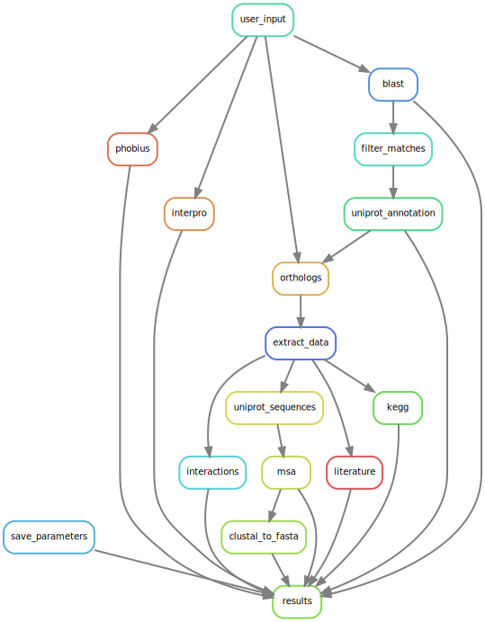

# Annotating proteins based on their sequence

Altough thousands of proteins have been identified in the last decades, for many of them the function remains unclear. Luckily there are numerous tools out there that can help us infer such functions based on simple input data (accession numbers or sequences). However the problem is the limited set of tools allowing us to query all these resources simultaneously. Therefore we aimed to coher some of these resources in a pipeline which only requires a proteins sequence as input and delivers a nice html file as output.


## Getting Started
**1.Clone this repository**
 ```bash
git clone https://github.com/koenvdheide/snakemake.git 
cd ~/snakemake
```
**2.Create & activate the conda environment**
 ```bash
conda env create -f envs/environment.yaml -n pipeline
conda source activate pipeline
```

**3. Run the pipeline!**
 ```bash
Snakemake results
```
## The config file (config.yaml)
This contains several parameters that can be adjusted by the user, such as `e-value cut-off` , `blast database`, `mail address`, etc. Besides the mail address the parameters do not have to be changed, but of course can be changed whenever preferred (the parameters will be saved to be able to differentiate runs). 

## A quick overview
We use several web resources to annotate your protein of interest. The steps (and order hereof) can be seen in the graph below:



## Example input +  output
We have provided an example sequence (see `example/sequence.fasta`) and an example output of this sequence (see `example/results.html`). 


## @Martijn
We used different approaches to retrieve information form webservices, with all having their own problems. But these also shared a common problem, whenever the web service is down your pipeline is dead as well `;)`. 

 **Client code**:
 
Downloading a client and using this to query a webservices is pretty straightforward.  The big advantages of such clients is that these have a list of parameters and advanced exception handling (with useful error messages).
We used several of these:
 * *Python*:
    * [InterProScan](https://www.ebi.ac.uk/seqdb/confluence/pages/viewpage.action?pageId=54652041) [EBI]
* *Perl*:
    * [BLAST](https://www.ebi.ac.uk/seqdb/confluence/pages/viewpage.action?pageId=54653532) [EBI]
    * [T-COFFEE](https://www.ebi.ac.uk/seqdb/confluence/pages/viewpage.action?pageId=54649835) [EBI]
    * [SeqRet](https://www.ebi.ac.uk/seqdb/confluence/pages/viewpage.action?pageId=57278711) [EBI]
    * [Phobius](https://www.ebi.ac.uk/seqdb/confluence/pages/viewpage.action?pageId=54652414) [EBI]

 **NCBI Pipe**:
 
 A little more advanced client is NCBI entrez direct, which you can use to pipe data from one NCBI webservice to another quite easily. We preferred to parse the data directly using an XML expression rather then saving the data first and processing it afterwards. Spreading downloading and post-processing over two separate rules would be perfectly fine in our opinion when each rule has sufficient body on its own. However post-processing in this case could been done in a single line. Hence, adding another rule would make the flow unnecessary more complicated to follow (and we learned something about XML parsing!!!)
 
* [Entrez Direct](https://www.ncbi.nlm.nih.gov/books/NBK179288/) 
    * To link a gene database query to a pubmed query  --> parsing using an XML expression (see code for further detail)

**WGET requests:**

Of course a webservice does not always provide a client code. Therefore we also wanted to practice data retrieval using `wget`. The hard part about this is that we preferably want to call the URL directly without pre-processing of the data. However nearly all webservices have their own way of seperating terms in the url, such as `<space>`, `+`, ` OR `, etc. Therefore we wrote a script (`formatter.py` ) which sperates query terms by a given separator. Now we could simply format the data in one single line and send the request in another one, such as:
```bash
query=$(python3 scripts/formatter.py {input} '+OR+' q)
wget "http://www.uniprot.org/uniprot/?query=$query...
```
Now its directly clear that we send a request to the above URL, which would not be the case when we would cover this all up in a Python script and calling it like so:
```bash
Python query_uniprot.py 
```
We used `wget` request in the following cases:
* [UniProt API](https://www.ebi.ac.uk/seqdb/confluence/pages/viewpage.action?pageId=54652414):
    * Annotation --> tab delimited retrieval
    * Sequences --> FASTA retrieval
* [STRING API](http://version10.string-db.org/help/api/):
    * Network --> image retrieval

**CURL requests:**

`wget` is particularly useful when copying remote files to a local one. This fitted our needs in the case of UniProt and STRING, however in the case of KEGG we wanted to process the data directly without saving it to a file first. Again because the post-processing is rather simple (code wise). Additionally, it would be quite useless and inefficient to save whole KEGG entries when we only use very specific information from it (and leave the rest untouched). This is were `curl` comes in handy, as this directs the returned page to `stdout`, and hence making piping easier. In this case we piped the retrieved KEGG entries in `json` format to an `jr` expression we wrote. Resulting in a tab-delimited file containing solely the information we were interested in. 

* [TOGOWS API](http://togows.org/):
    * KEGG annotation --> json parsing --> tab delimited data

**Role of other scripts:**

All the other scripts basically function as bridges between web services, except the `results.Rmd` script. The `results.Rmd` script combines the information from all the webservices and renders a HTML document. This document:
* Shows all the results from the webservices
* Shows the used parameters  (also after changing these in the config.yaml file --> *dynamic*). The user can thus compare parameters of different runs and see which work the best. It also comes in handy when interpreting the results of course. 
* Gives links to websites with instructions on how to interpret the figures/data.
* Gives links to relevant result files whenever these were not included in the `results.html` file.


**What about the biology?:**

The aspects are not covered in this GitHub repository, these are mentioned thoroughly in the output of the pipeline. Please see `examples/results.html` for such an example. 


## Authors

* **Rick Beeloo** - *r.beeloo@outlook.com*
* **Koen van der Heide** - *koen_van_der_heide@hotmai.com*

## Acknowledgments

* Martijn van der bruggen for his enthusiasm and encouragement
