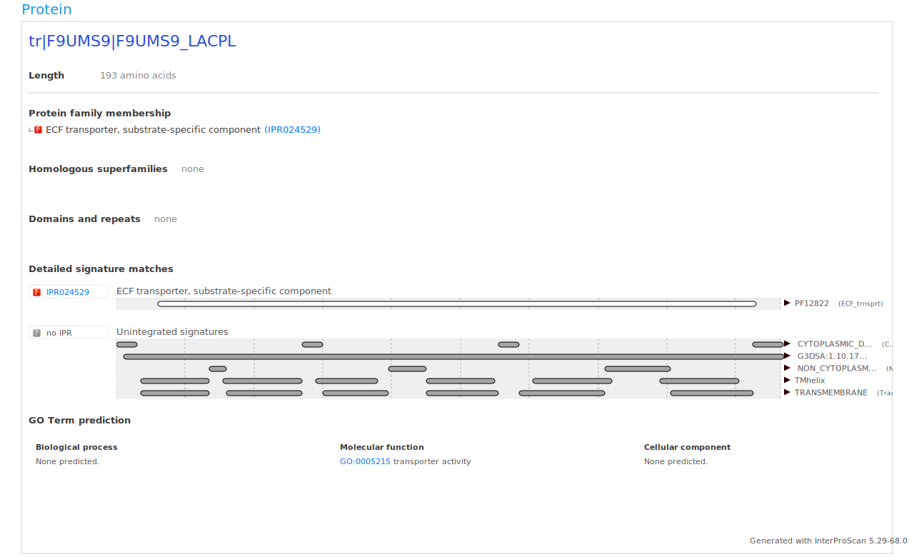
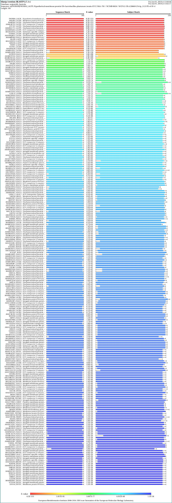
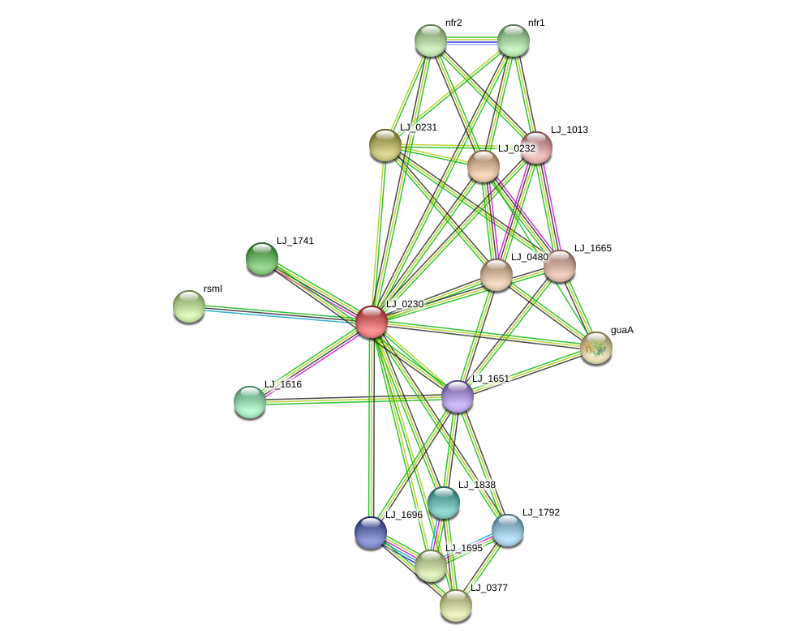

*Authors: Rick Beeloo & Koen van der Heide*


```{r setup, include=FALSE}
knitr::opts_chunk$set(echo = TRUE)
library(knitr)
library(dplyr)
library(ggtree)
library(kableExtra)
```

### <span style="color:#42c8f4">Goal</span>
Unraveling the function of a protein is valuable in understanding its role in an organisms and may aid in drug discovery. Although tons of proteins have been annotated in recent years, many times a researcher will encounter proteins with function descriptions like 'unknown'  or 'hypothetical'. Such information is undoubtedly essential in experiments where such genes bind to your protein of interest or show differential expression. Direct prediction of a proteins function is hard if not impossible, however research can mostly derive this form annotation instantly. Hence, we wrote a script gathering such information. Two parts can be distinguished: 

* **BLAST independent**, analysis solely based on the FASTA input:
    + PHOBIUS, subcellular location
    + InterPro, motif in the protein sequence

* **BLAST dependent**, analsyis based on proteins similar to the inputted protein:
    + MSA, highlighting conserved amino acids (perhaps functional ones)
    + Literature, articles mentioning similar genes
    + STRING, interactions of the similar proteins
    + KEGG, Pathways of the similar genes
  
***

### <span style="color:#42c8f4">Input</span>
```{r echo = FALSE}
params <- read.table('data/parameters.txt', header = T, sep = '\t')
```
**Note** You gave `r params$mail` as mail address, hence you could receive emails from the web services used in this pipeline when for example an error occurred or a limit exceeded. 
The following FASTA was analyzed:

```{r echo = FALSE}
seq.file <- readLines('data/sequence.fasta')
df <- data.frame(
  `Sequence information` = c(seq.file[[1]] , seq.file[[2]])
) 
names(df) <- NULL
df %>%
  kable("html") %>%
  kable_styling(bootstrap_options = "striped", full_width = F, position = "left")
```

### <span style="color:#42c8f4">Protein location (Phobius)</span>

Location is a fundamental aspect of a proteins function, therefore we used the well-known PHOBIUS algorithm to predict this for the input sequence. 


**Visual output**


**Textual output**

```{r echo = FALSE}
phobius.res <- readLines('data/phobius_result.out.txt')
print(phobius.res)
```

Information about how to interpret this information can be found [here](http://phobius.sbc.su.se/instructions.html). 

***

### <span style="color:#42c8f4">Motifs and domains (InterPro)</span>

Motifs and domains often provide valuable clues regarding the function of a protein. For example whenever a DNA binding site is present in a protein the number of possibile functions greatly reduces. Such information is available in various databases such as PFAM, CDD, ProSite etc. All these can be queried simultaneously using InterPro. 

**Visual output**




**Textual output**

Unfortunately the textual output does not have a header, nonetheless it's easy interpretable.

```{r echo = FALSE}
df <- read.table('data/proscan_result.tsv.txt',sep = '\t', header = F, fill = T)
names(df) <- NULL
df %>%
  kable("html") %>%
  kable_styling(bootstrap_options = "striped", full_width = F, position = "left") %>%
  scroll_box(width = "1000px", height = "500px")
```

***

### <span style="color:#42c8f4">BLAST</span>

Arguably the easiest way to derive the function of a protein is to find a protein that looks like the protein of interest and simply assume that whenever the match is 'good' that the function will be the same. Therefore a BLAST was performed against `r params$blast_database` with a maximum number of alignments of `r params$blast_max_alignments`. Hereafter, the significant matches were determined based on an E-value cut-off of `r params$e_value_cut_off` and a identity% greater than `r params$identity_cut_off`. 

**Visual output**


Information of the interpretation hereof can be found [here](https://www.biostars.org/p/3920/). Also you may be more familiar with the textual output which can be found [here](blast_results.out.txt) 

***

### <span style="color:#42c8f4">Uniprot</span>
```{r echo = FALSE}
uniprot.para <- read.table('data/uniprot_para_records.txt',sep = '\t', header = T, fill = T)
uniprot.ortho <- read.table('data/uniprot_ortho_records.txt',sep = '\t', header = T, fill = T)
```

The protein sequences and annotation for the significant BLAST matches was retrieved from UniProt. Based on this annotation the matches were splitted based on the criteria of whether these originated from the same or a different species. Although the definition of paralogs and orthologs is much stricter, we refer to the former as paralogs and the latter as orthologs. This split resulted in `r nrow(uniprot.para)` paralogs and `r nrow(uniprot.ortho)` orthologs. 

**Paralog annotation**

```{r echo = FALSE}
uniprot.para %>%
   select(-`Cross.reference..kegg.`) %>%
  kable("html") %>%
  kable_styling(bootstrap_options = "striped", full_width = F, position = "left") %>%
  scroll_box(width = "800px", height = "300px")
```

<br>
**Ortholog annotation**


```{r echo = FALSE}
uniprot.ortho %>%
   select(-`Cross.reference..kegg.`) %>%
  kable("html") %>%
  kable_styling(bootstrap_options = "striped", full_width = F, position = "left") %>%
  scroll_box(width = "1000px", height = "500px")
```

<br>
**Uniprot sequences**

As seeing the downloaded sequences is not that useful we refer to the [FASTA file](uniprot_sequences.txt) of these and chose to not include these in the report directly.

**Note**: The chance of finding useful information about the protein in other species is reasonably higher than for protein from the same species. Therefore only orhologous matches were used for subsequent analysis.


***

### <span style="color:#42c8f4">Literature search</span>
Basically two approaches can be used to search genes in the literature, text-mining or database coupling. We chose to use the latter in this case as protein names can greatly result in false positives due to uninformative names or different namings. So we coupled the gene database to the PubMed database, thereby coupling the genes to the uploader information which greatly enhances reliability. 

```{r echo = FALSE}
literature.table <- read.table('data/literature_results.txt',sep = '\t', header = F, fill = T)
colnames(literature.table) <- c("Title","Journal","Year","PMID","Abstract")
literature.table %>%
  kable("html") %>%
  kable_styling(bootstrap_options = "striped", full_width = F, position = "left") %>%
  scroll_box(width = "1000px", height = "500px")
```


***

```{r echo = FALSE}
kegg.map.dat <- uniprot.ortho %>%
  select(Entry,  kegg.map = Cross.reference..kegg.)

kegg.results <- kegg.map.dat %>%
  filter(kegg.map != '') 
kegg.results$kegg.map <- gsub(';','',kegg.results$kegg.map)

```

### <span style="color:#42c8f4">Kegg</span>
The data retrieved from Uniprot such as pathway and biological process already points into the right direction, however sometimes it's useful to look at pathway maps to infer the flow of metabolites and hence better understand the role of a protein. We could couple `r nrow(kegg.results)` Uniprot entries to the corresponding KEGG entry. It's important two keep **two things** in mind when coupling proteins to KEGG:

*   Not all proteins are included in KEGG. Although ideally all proteins could be mapable to KEGG, this will practically not be the case. 
*   A protein can be part of multiple pathways, and some pathways are sub pathways of others.
```{r echo = FALSE}
kegg.data <- tryCatch(read.table("data/kegg_table.txt", sep = '\t', header = F), error=function(e) NA)
suppressWarnings(
if (!is.na(kegg.data)) {
  colnames(kegg.data) <-c('Gene ID','Pathway ID','Pathway name')
} else {
  kegg.data <- data.frame()
}
)
```
Out of the `r nrow(uniprot.ortho)` Uniprot entries we were able to map `r nrow(kegg.results)` of them to KEGG, out of these **`r nrow(kegg.data)`** were coupled to a KEGG pathway. 

```{r echo = FALSE}
colnames(kegg.results) <- c('Uniprot entry', 'Gene ID')
if (nrow(kegg.data) > 0) {
  full.table <- suppressMessages(suppressWarnings(kegg.data %>% left_join(kegg.results)))
  colnames(full.table) <- c('Kegg ID','Pathway name', 'Pathway ID', 'Entry')
  full.table %>%
  kable("html") %>%
  kable_styling(bootstrap_options = "striped", full_width = F, position = "left") %>%
  scroll_box(width = "1000px", height = "500px")
} 

```


### <span style="color:#42c8f4">Protein interactions</span>
Until now we focused on the individual proteins, however it may be useful to look at the interactions of the similar proteins. When our best matching protein from the BLAST results interacts with for example a glucose transporter this helps to understand the function of the protein. Therefore we queried all the significant matches against the STRING database and gathered their neighbours with a limit of `r params$max_numb_con` nodes:



### <span style="color:#42c8f4">Multiple sequence alginment (MSA) </span>
To get insight in the conservation of such sequences a MSA was performed using T-COFFEE <br>
```{r echo = FALSE}
tree <- read.tree('data/t_coffee_msa.phylotree.ph')
fasta <- 'data/fasta_msa.out.txt'
suppressMessages(suppressWarnings(msaplot(p=ggtree(tree), fasta)))
```


### <span style="color:#42c8f4">Code</span>
In this rapport we mainly foccused on the biological aspects of the pipeline. We chose to dedicate a gihtub repository to the technical aspects of this pipeline.


